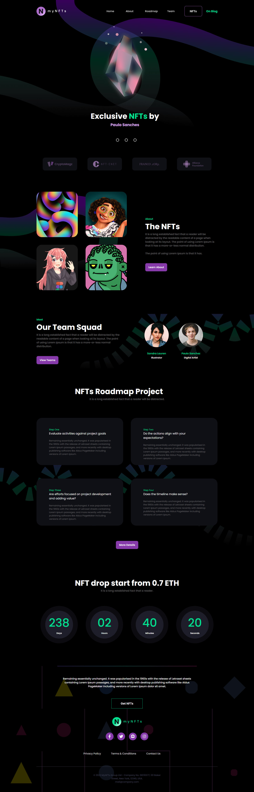

<h1 align="center">
  NFT Creator Website Design
</h1>

  

  <a href="#-tecnologias">Tecnologias</a>&nbsp;&nbsp;&nbsp;|&nbsp;&nbsp;&nbsp;
  <a href="#-projeto">Projeto</a>&nbsp;&nbsp;&nbsp;|&nbsp;&nbsp;&nbsp;
  <a href="#memo-licença">Licença</a>

  

 

  

## 🚀 Tecnologias

Esse projeto foi desenvolvido com as seguintes tecnologias:

- HTML
- CSS
- JavaScript

 

## 🚧 Projeto

Live Preview: https://mynfts-rangelrobson.vercel.app/

 

## 🎨 Inspiração:

Figma: https://www.figma.com/file/hBjeZZ5quNELz3GkmWCtq1/MyNFTs---NFT-Creator-Website-Design-(Community)
